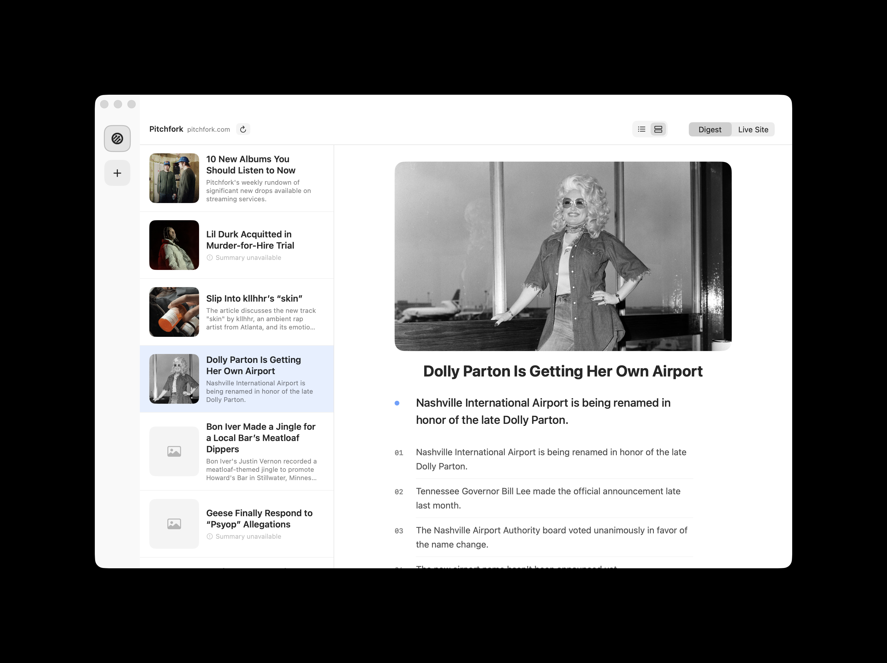

# Skim

A tiny native Mac news reader. Add up to 5 sites, click a headline, get the actual point — summarized entirely on your Mac, no account, no cloud API, no cost.

<p align="center">
  
</p>

## Download

**[Download for Mac →](https://github.com/hey-niia/skim/releases/latest)**

Requires macOS 26 (Tahoe) or later with Apple Intelligence enabled. Skim is unsigned, so on first launch macOS will say it "cannot be opened because the developer cannot be verified." Right-click the app → **Open** → **Open** again, or run:

```
xattr -cr /Applications/Skim.app
```

## The story

I read the same three sites every day — The New York Times, Ukrainian Pravda, and Pitchfork — by keeping a row of pinned browser tabs open and clicking between them. Most of what's actually *in* an article is one idea and a couple of supporting facts; the rest is scrolling. Apple News solves the "many sources" problem by drowning you in *more* sources. I wanted the opposite: a short, deliberate list of the handful of sites I actually read, and a way to get to the point of each article without leaving the app.

The idea I kept coming back to was to treat sources the way the Dock treats apps — a short row of icons you click between — but paired with something a browser tab genuinely can't do: read the headline, extract the article body, and hand it to an on-device model that gives back one main idea and a few key points. On-device wasn't a compromise; it was the point. It meant no API key, no per-article cost, and nothing about what I read leaving my machine.

I designed and directed every piece of this end to end — the "sources as a dock" concept, the digest format (main idea first, numbered points, cover image pulled from the article itself), the background-prefetch behavior so headlines are already summarized by the time you open the app, and a long list of small interaction calls: what a compact vs. comfortable list density should look like, how a failed summary should be marked so you don't click it twice, why the reading column needs to recenter itself instead of assuming a fixed window width. Claude Code wrote the Swift; the product decisions, the visual direction, and the review of every iteration were mine.

## What it does

- **Up to 5 sources**, added by URL, shown as a row of icons — click to switch, hover to remove.
- **Digest view**: headlines pulled straight from each site's homepage, with a thumbnail lifted from the page itself.
- **On-device summaries**: click a headline and Apple's on-device Foundation Models framework reads the article and returns a main idea plus a handful of concrete key points — not a generic "this article is about..." blurb.
- **Background prefetch**: the first ~25 headlines per source summarize themselves quietly in the background, so most of what you click is already waiting for you.
- **Live Site view**: a real embedded browser for when you want the whole page.
- **Auto-refresh** every 15 minutes, persisted window size and list/article split, all without a server anywhere in the loop.

Apple's on-device model also has its own safety guardrails and will decline to summarize some articles — mostly ones about war or violence. When that happens, Skim tells you plainly and gets out of the way, rather than pretending it's a bug.

## Development

```
brew install xcodegen
xcodegen generate
open Skim.xcodeproj
```

Built with SwiftUI + the Foundation Models framework. `Skim/Services` has the article extraction (WKWebView + heuristic DOM scraping) and the summarizer; `Skim/Stores` has the per-source state and the background prefetch queue; `Skim/Views` has the UI.

## License

MIT
